# 🚀 Missile Commander

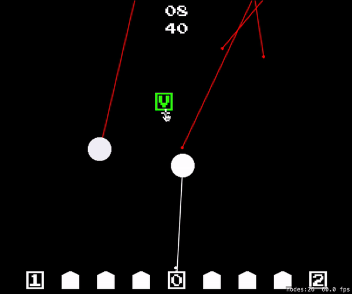  
Missile Commander 는 Missile Command(1979) 로부터 영감받은 레트로게임입니다. 구현에 SpriteKit을 사용했으며, 스프라이트 텍스쳐를 그리기 위해 [pixilart](https://www.pixilart.com)를, 효광음을 만들기위해 [Bfxr](https://www.bfxr.net/) 를 사용했습니다.  

## Goal
적의 공격으로부터 가능한 오래 살아남으며 점수를 획득하는것이 목표입니다.
## Buildings

사일로는 건물을 방어하기위해 요격미사일을 발사할 수 있습니다. 최대 3개의 사일로를 가질 수 있고, 모든 사일로가 파괴되면 게임에서 패배합니다.

 
도시를 미사일 공격으로부터 방어해야합니다. 6개의 도시가 있으며, 모두 파괴되면 게임에서 패배합니다.

## Enemy

적의 공격은 사일로와 도시를 파괴하는것을 목표로 합니다. 적의 탄두가 건물을 파괴하기 전에 요격미사일을 발사해 파괴하세요.

짜르는 가장 거대한 탄두입니다. 폭발 범위도 굉장히 넓기 때문에 조심히 다뤄야 합니다.

 Bomber 는 빠른 속도로 영공을 가로지르며 수많은 탄두를 뿌립니다.  

## Play
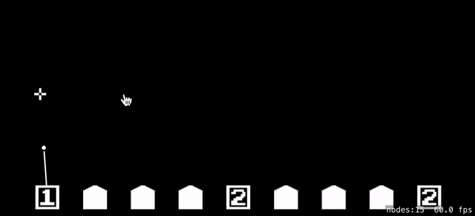  
게임 화면을 클릭해서 요격 미사일을 발사할 수 있습니다. 클릭된 지점으로부터 가장 가까운 사일로로부터 미사일이 발사되며, 해당 사일로에 준비된 미사일이 없다면, 재장전에 시간이 소요됩니다. 

## Items
당신을 돕기 위한 아이템들이 게임 화면상에 나타날 것 입니다.  
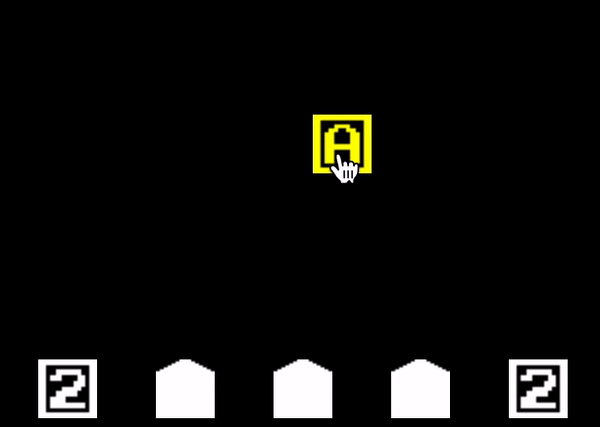  
A - Ammunition. 사일로의 최대 미사일 장탄수를 증가시키며, 즉시 모든 사일로가 최대 장탄수로 재장전됩니다. 
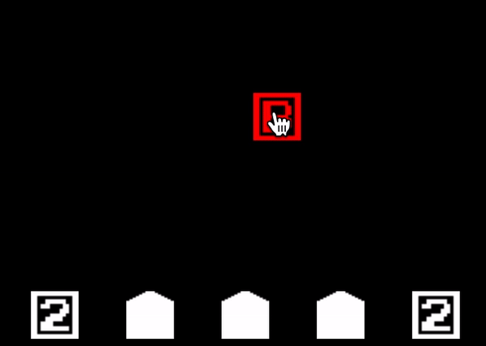  
B - Blast Range. 요격 미사일의 폭발 범위를 증가시킵니다.  
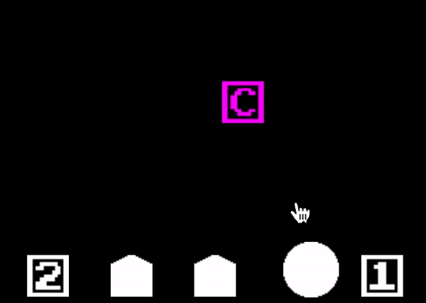  
C - City. 파괴된 도시가 있다면 해당 아이템으로부터 가장 가까운 빈 공간에 도시를 재건합니다. 도시는 최대 6개가 동시에 존재할 수 있습니다.  
  
D - Duration, 모든 폭발 지속시간을 증가시킵니다.  
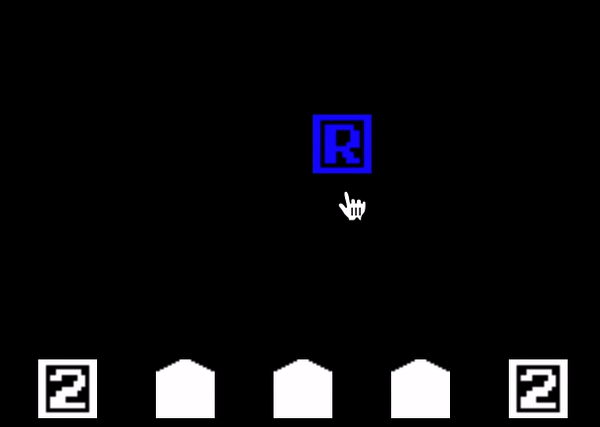  
R - Reload Time. 사일로의 재장전 시간을 감소시킵니다.  
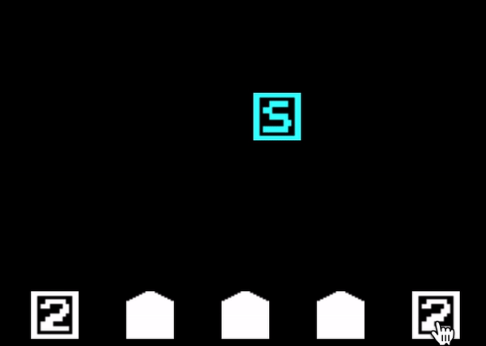  
S - Silo. 파괴된 사일로가 있다면 해당 아이템으로부터 가장 가까운 빈 공간에 사일로를 재건합니다. 사일로는 최대 3개가 동시에 존재할 수 있습니다.  
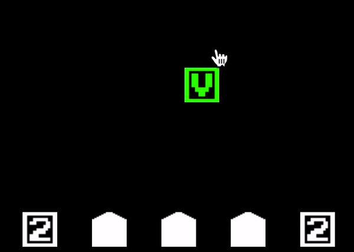  
V - Velocity. 사일로에서 발사한 요격 미사일의 속도가 향상됩니다. 
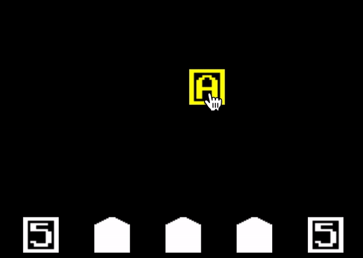  
이미 해당 능력의 max level에 도달했다면, 대신 점수를 받습니다.  
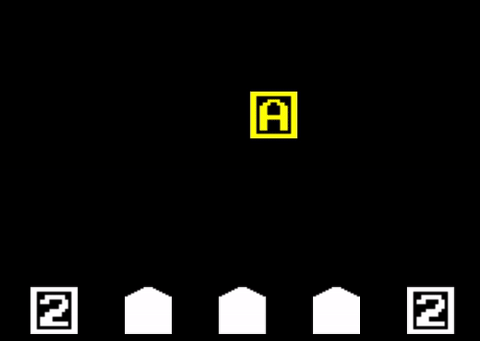  
아이템은 5초마다 한번씩 다른 아이템으로 변화합니다. 만약 원하는 아이템이 나오지 않았다면 다른 아이템으로 변할 때 까지 기다리는것도 좋습니다. 하지만 3번 변화한 이후엔 사라지니 조심해야합니다.

## Difficulty
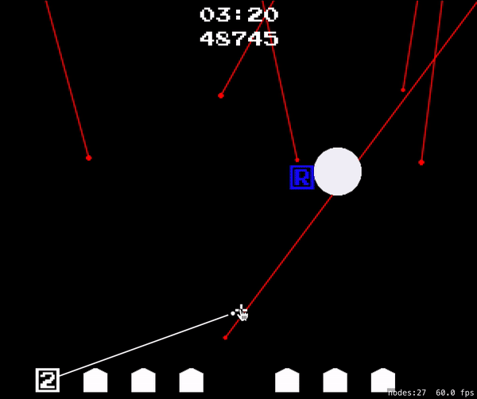   
적의 공격은 매 30초마다 더 강력해집니다. 

## Combo system
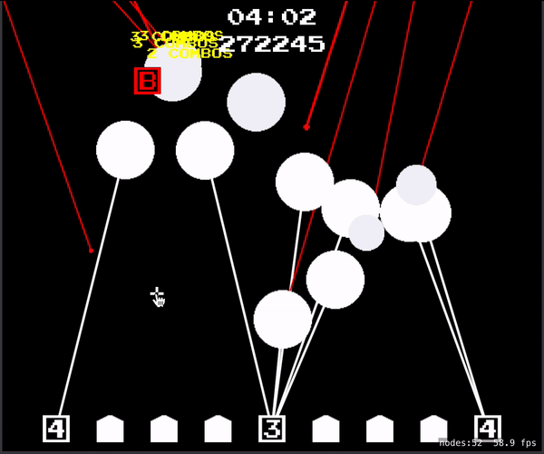 
폭발 연쇄 콤보 시스템이 있습니다. 만약 적의 탄두를 격추하면, 해당 탄두도 폭발하고, 그로 인해 다른 탄두도 폭발할 수 있습니다. 이런식으로 폭발을 연쇄시키면, 콤보가 발생하고 이는 추가 점수로 부여됩니다.